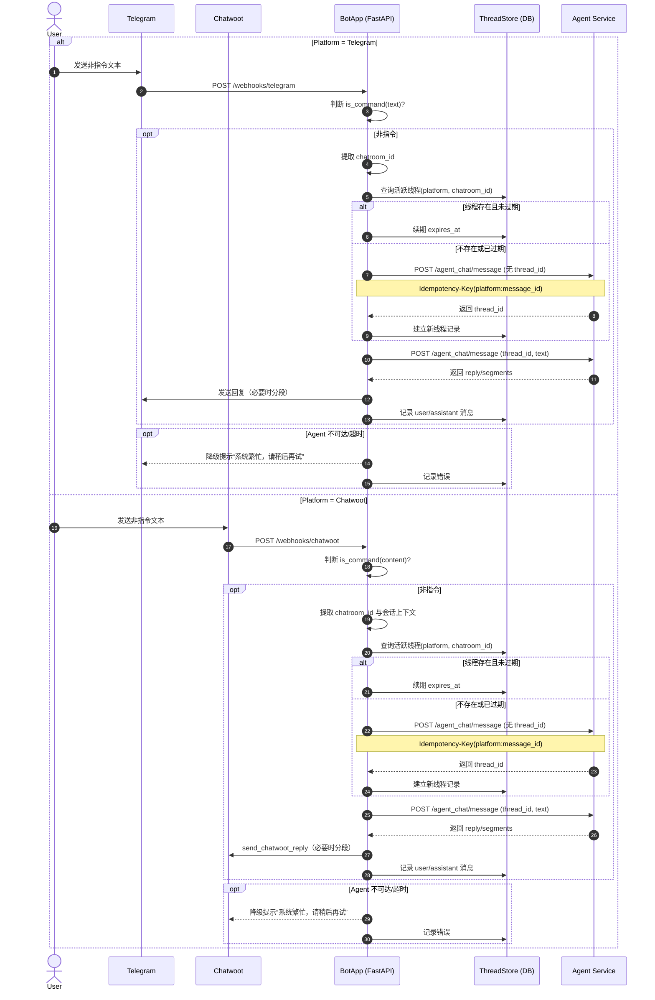

# Agent 聊天路由与线程策略方案

## 目标
- 当用户输入的文本不是指令（如`/ai_pick`、`/ai_yesterday`、`/ai_history`、`/help`、`/start`），统一转发到已部署的 Agent 服务进行处理。
- 统一使用`chatroom_id`标识会话来源，使用`thread_id`管理上下文线程生命周期，保障连续多轮对话的上下文一致性。
- 为不同入口（Telegram、Chatwoot）制定一致的线程策略、数据记录与可观测性方案。

## 名词与来源
- `agent_url`：来自配置文件，当前为`.env`中的`agent_url`（示例：`https://agent.airedspark.com`）。
- `chatroom_id`：
  - Telegram：使用`message.chat.id`（已在`app/routes.py:170-209`中获取）。
  - Chatwoot：使用附加属性中的`chat_id`或`source_id`（提取逻辑见`app/utils.py:98-118`）。
- `thread_id`：由Agent服务在会话开启或恢复时生成或返回，用于标识一次连续的话题线程。
- `platform`：来源渠道，取值`telegram`或`chatwoot`。

## 总体流程
- 入口判断：
  - Telegram 入站：`app/routes.py:170-209`对命令进行分支处理；在所有命令分支外的普通文本，转发至Agent。
  - Chatwoot 入站：`app/routes.py:27-149`在`message_type == incoming`时处理命令；非命令文本转发至Agent。
- 线程选择：
  - 根据`platform + chatroom_id`查询是否存在未过期的活跃线程；
  - 如无活跃线程或已过期，则向Agent发起“开始/恢复线程”请求以获取`thread_id`；
  - 将用户消息携带`thread_id`转发给Agent，并根据Agent响应进行回复。
- 回复分发：
  - Telegram：将Agent返回的文本分段（必要时）发送到`chat_id`；
  - Chatwoot：通过`send_chatwoot_reply`在原会话中回复（参考`app/services.py:11-40`）。

## 与Agent的接口契约（建议）
- 入站（我们→Agent）：`POST {agent_url}/agent_chat/message`
  - 请求体：
    - `platform`：`telegram`|`chatwoot`
    - `chatroom_id`：来源会话标识
    - `thread_id`：可为空；为空表示请求Agent新建或恢复线程
    - `text`：用户原始文本
    - `message_id`：平台侧原消息ID（去重用）
    - `sender_id`、`username`：用户标识与可读名（可选）
    - `timestamp`：ISO时间戳
    - `conversation_id`、`account_id`、`inbox_id`：Chatwoot上下文（如有）
    - `attachments`：[{`type`,`url`,`name`}...]（可选）
    - `locale`/`country`：区域信息（可选）
  - 幂等性：使用`Idempotency-Key: {platform}:{message_id}`避免重复处理。
- 出站（Agent→我们）：
  - 返回：`{ thread_id, reply, segments?, meta? }`
    - `thread_id`：线程标识（新建或沿用）
    - `reply`：字符串或富文本（必要时按平台拆分分段）
    - `segments`：可选，已分段的消息列表
    - `meta`：可选，包含置信度、意图、动作建议等

## 线程策略
- TTL（滑动过期）：
  - Telegram：`THREAD_TTL_MINUTES_TELEGRAM = 30`（最后一次交互后30分钟内续用同一线程）
  - Chatwoot：`THREAD_TTL_MINUTES_CHATWOOT = 720`（12小时），适配客服场景的较长上下文
  - 硬过期上限：`THREAD_MAX_AGE_DAYS = 7`，避免永久线程占用。
- 续期策略：
  - 每次用户新消息到达，若仍在TTL内，则更新`last_activity_at`并续`expires_at = now + TTL`。
  - 超过TTL或硬过期则新建线程并返回新的`thread_id`。
- 重置触发：
  - 显式重置词：如“新话题”“换个话题”“重置”“reset”等，触发新线程。
  - 指令类消息（`/start`、`/ai_*`、`/help`）不参与Agent线程，属于独立分支处理。
- 多平台一致性：
  - `thread_id`按`platform + chatroom_id`维度管理，不跨平台共享（避免上下文混淆）。

## 数据存储与记录
- 现有：
  - Chatwoot入站消息已通过`store_message`落表（见`app/services.py:185-235`），表结构在`app/db.py`中定义。
- 新增建议：
  - 表`agent_threads`（管理线程）：
    - `id` PK，`platform`，`chatroom_id`，`agent_thread_id`（唯一），`subject`（可选），`started_at`，`last_activity_at`，`expires_at`，`status`（active/closed），`metadata`（JSONB）
    - 索引：`(platform, chatroom_id, status)`、`expires_at`
  - 表`agent_message_log`（请求/响应审计）：
    - `id` PK，`platform`，`chatroom_id`，`agent_thread_id`，`role`（user/assistant/system），`text`，`message_id`，`created_at`，`attachments`（JSONB），`agent_request_id`（可选），`response_status`，`tokens`（可选），`conversation_id/account_id/inbox_id`（Chatwoot侧字段）
  - 目的：支持问题追踪、复现、统计与合规留痕。

## 并发、幂等与一致性
- 并发：同一`platform + chatroom_id`处理时采用数据库轻量锁或PG advisory lock，防止并发创建多个线程。
- 幂等：以`Idempotency-Key`确保同一平台消息不被重复转发与重复应答。
- 一致性：在创建/续期线程时事务化更新`agent_threads`，避免“过期窗口”引发的竞态。

## 错误处理与降级
- Agent不可达或超时：
  - Telegram：回复固定降级文案（如“系统繁忙，请稍后再试”）。
  - Chatwoot：通过`send_chatwoot_reply`在原会话提示稍后重试。
- 重试：对网络类错误进行有限次数重试（例如2-3次，指数退避）。
- 观测：记录错误码、耗时、超时次数，便于后续排查。

## 配置与安全
- 配置：
  - 读取`.env`中的`agent_url`（见`.env:26`），在`config.py`中提供`agent_url()`访问函数。
  - TTL与开关项以环境变量或配置文件参数化，便于灰度调优。
- 安全：
  - 不透传平台token或隐私数据到Agent，仅传必要上下文。
  - 附件处理采用临时URL或受限访问策略（如有效期、签名）。

## 实施步骤（只读方案，暂不编码）
- 增加配置读取：在`app/config.py`新增`agent_url()`，读取`.env`中的`agent_url`。
- 扩展DB：新增`agent_threads`与`agent_message_log`两张表（初始化在`app/db.py`中执行）。
- Telegram入口改造：在`app/routes.py:170-209`中，所有命令分支处理后，对剩余普通文本分支调用Agent。
- Chatwoot入口改造：在`app/routes.py:27-149`的`incoming`分支中，对非命令文本调用Agent，并用`send_chatwoot_reply`回写。
- 统一线程选择与续期：抽象服务层函数负责查/建线程、续期TTL、落库与转发。
- 审计与监控：为Agent往返请求增加日志与数据库留痕，并输出基础指标（调用量、失败率、耗时）。

## 开发步骤（落地清单）
- 新增配置读取：在`app/config.py`增加`agent_url()`，读取`.env`中的`agent_url`（见`.env:26`）；增加TTL相关环境变量读取（如`THREAD_TTL_MINUTES_TELEGRAM`、`THREAD_TTL_MINUTES_CHATWOOT`、`THREAD_MAX_AGE_DAYS`）。
- 扩展数据库：在`app/db.py`新增`agent_threads`与`agent_message_log`表及必要索引；确保初始化幂等。
- 封装Agent客户端：在`app/services.py`新增`post_agent_message(payload, idempotency_key)`，负责向`{agent_url}/agent_chat/message`发送请求，包含重试、超时与错误处理。
- 线程管理服务：在`app/services.py`或新建模块中实现`find_active_thread(platform, chatroom_id)`、`create_thread(...)`、`touch_thread(...)`；采用PG advisory lock防止并发创建；遵循TTL与硬过期策略。
- Telegram路由改造：在`app/routes.py:170-209`处理完命令分支后，若文本为非指令，调用线程服务+Agent客户端，按需要分段回复到`chat_id`；记录请求与响应至`agent_message_log`。
- Chatwoot路由改造：在`app/routes.py:27-149`的`incoming`分支对非指令文本执行同样流程；回复用`send_chatwoot_reply`（参考`app/services.py:11-40`）；长文本分段发送。
- 幂等与去重：基于平台消息ID构造`Idempotency-Key`（`{platform}:{message_id}`）；服务侧避免重复调用与重复回复。
- 审计与可观测：将用户与助手消息、错误码、耗时、重试次数写入`agent_message_log`；在日志中加平台与线程标识，便于检索。
- 错误降级：Agent不可达或超时，按平台回发固定降级文案；仍然写入审计日志。
- 测试计划：
  - 单测：TTL续期/过期、新线程创建、并发锁、去重。
  - 集成：使用本地或假Agent端点验证Telegram与Chatwoot完整链路。
  - 回归：命令分支（`/ai_*`、`/help`、`/start`）不受影响。
- 发布与回滚：灰度开关控制Agent转发；观察指标与错误率；异常时可切回原逻辑仅处理指令。

## Mermaid 时序流程图（非指令文本转Agent）

## 代码关联参考
- Telegram入站处理：`app/routes.py:170-209`
- Chatwoot入站处理：`app/routes.py:27-149`
- Chatwoot回复函数：`app/services.py:11-40`
- Chatwoot消息入库：`app/services.py:185-235`
- Chatroom提取：`app/utils.py:98-118`
- 环境配置：`.env:26`（`agent_url`）
